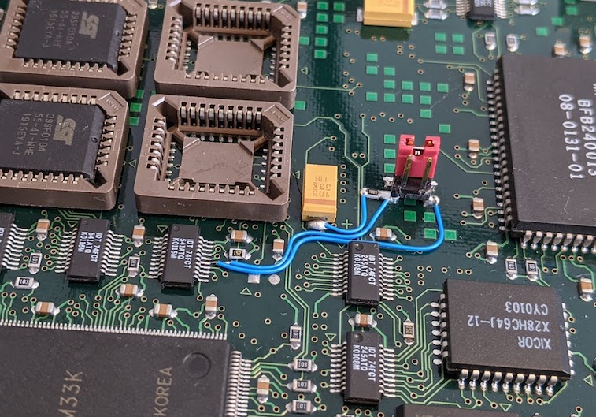

# Cisco 1600R Series Reverse Engineering
Documented here is my effort to reverse engineer enough detail about the Cisco 1600R series router platform in order to be able to run my own code.

- [Cisco 1600R Series Reverse Engineering](#cisco-1600r-series-reverse-engineering)
    + [Rationale](#rationale)
    + [Platform Brief](#platform-brief)
    + [Conventions](#conventions)
  * [Memories](#memories)
    + [Boot ROMs](#boot-roms)
    + [NVRAM](#nvram)
    + [DRAM](#dram)
    + [Flash](#flash)
  * [Peripherals](#peripherals)
    + [UART](#uart)
    + [Timers](#timers)
    + [Watchdog](#watchdog)
    + [Ethernet Controller](#ethernet-controller)
    + [GPIO](#gpio)
    + [DMA](#dma)
  * [Peripherals and External Registers](#peripherals-and-external-registers)
    + [WIC Slot](#wic-slot)
    + [On-board ISDN Controller](#on-board-isdn-controller)
    + [System Option Register](#system-option-register)
    + [LED Control Register](#led-control-register)
- [Other](#other)
  * [Minimal Startup Code](#minimal-startup-code)
  * [Reset Button Modification](#reset-button-modification)
  * [Overclocking](#overclocking)

### Rationale
This was an extension of my [Cisco 2500 reverse engineering](https://github.com/tomstorey/c2500re) effort, something which I took up while waiting for some PCBs to arrive to test out an idea for providing IO via one of the Flash sockets.

### Platform Brief
The 1600R series is interesting due to the use of a Motorola 68360, which is somewhat like a microcontroller featuring a CPU32 core (similar to a 68020) and many built in peripherals. My work was done using a 1603R, and a summary of its most notable features is:

* Motorola 68360 clocked at 33MHz (some models may be 25MHz?)
* Built-in timers, UART, ethernet controller and DMA channels
* 8MB on-board RAM
* 72 pin SIMM slot accepting an additional 16MB of DRAM
* 4 boot ROM sockets
* 1 WIC slot for I/O
* PCMCIA socket for non-volatile storage
* 8KByte EEPROM (NVRAM) storing the routers configuration and other information

These features will be addressed in more detail in their respective sections below.

A nice feature about the 1600R is that they are a fanless device, which may be more appealing to some people. A downside is that they use an external power brick.

There are no significant proprietary chips on the board this time, but there are two large Altera EPM7000 series CPLDs which do integrate some functionality. With most peripherals being contained within the 68360, documentation is readily available, and only a few other details are required to interact with the rest of the hardware.

### Conventions
I use the following conventions in my documentation:

* A forward slash (/) after a signal name indicates that the signal is active low, or negative logic
* In register bit tables:
  * R indicates that a register is readable
  * W indicates that a register is writable, and will read back the same value written
  * w indicates that a register is writable, but the value read back may not represent what was written, or the register is write-once
  * -0 indicates the bit reads as 0 on reset, and -1 reads as a 1. -? means the bit value is indeterminate on reset (e.g. influenced externally).

## Memories
A notable feature of the 68360 is that it can generate chip select signals internally, with fully programmable base addresses and address masks. This means that the memory map is not strictly fixed, and memories can thus be located anywhere the programmer wishes them to be.

In this document I will indicate the "default" positioning of the various memories (according to the disassembly of the boot ROMs) and the chip select they are connected to (which will correspond to a particular pair of BR and OR registers). While the chip selects cannot be modified as they are fixed by the hardware design, the memory map can be customised as you see fit.

### Boot ROMs
The 1600R has four PLCC32 sockets for holding boot ROMs. The boot ROM code comprises a monitor (ROMmon) and a basic IOS.

Once again, the ROMs were found to be 8Mbit in size, and are arranged as such in the 4 sockets:

* FW1 and FW3 even bytes
* FW2 and FW4 odd bytes

FW1 and FW2 form a pair, as do FW3 and FW4.

The boot ROMs present a 16 bit port to the CPU.

Bit order in the boot ROMs is "natural" on the 1600R, unlike the 2500 series where it was mirrored. One thing I did notice, however, is that the ROMs were split down the middle and the two halves swapped, indicating that the most significant address bit (A19) may be inverted. This theory was tested and confirmed - when using 4Mbit ROMs I had to swap the two 2Mbit halves of the image in order to function correctly. A19 is supplied by one of the CPLDs, so it is probable the inversion is being applied in there.

Boot ROMs are mirrored at addresses 0 and 0x04000000, although this is not a strict requirement. FW1 and FW2 can cover the address range 0-XX1FFFFF, while FW3 and FW4 then cover 0xXX200000-XX3FFFFF within these windows. Boot ROMs use CS0/, which at reset begins at address 0 and covers the entire address space allowing the reset vector to be read by the CPU. This window may then be closed up by modifying the OR0 and BR0 registers appropriately.

Due to the ROMs being 8Mbit in size, smaller ROMs will once again encounter an issue with the WE/ pin being driven by an address signal. Unlike the 2500 series, there are no pre-existing jumpers to address this, so a hardware mod is required to be implemented by the user. This requires some fine and delicate soldering, so unfortunately will not be accessible to everyone. None the less, details are provided here for anyone that wishes to attempt it.




The jumper can then be added to run the factory boot ROMs, or removed for 1, 2 or 4Mbit ROMs.

As with the 2500, it should be possible to utilise the full capacity of 4Mbit ROMs by arranging the contents appropriately, taking into account the inverted nature of A19 (assuming base address of 0):

* FW1/FW2
  * CPU 0x0-3FFFF/ROM 0x40000-7FFFF when CPU A19/ROM A18 is high
  * CPU 0x80000-BFFFF/ROM 0x0-3FFFF when CPU A19/ROM A18 is low
* FW3/FW4
  * CPU 0x200000-23FFFF/ROM 0x40000-7FFFF when CPU A19/ROM A18 is high
  * CPU 0x280000-2BFFFF/ROM 0x0-3FFFF when CPU A19/ROM A18 is low

### NVRAM
NVRAM is a 8Kbyte EEPROM, part number X28HC64J, which holds the routers configuration register (ala 0x2102) and configuration (startup-config), along with some other data known as a "cookie" which contains the routers Ethernet MAC address.

The NVRAM is soldered to the board as opposed to being socketed. For your own purposes, you might completely ignore this chip, or you might write code to erase and re-program it yourself.

NVRAM is located at address 0x0E000000, and uses CS7/.

The NVRAM presents an 8 bit port to the CPU.

EEPROMs are not directly writable, and usually require some form of erase operation before data can be written back. Therefore the correct sequence of operations needs to be established before this can function as a form of non-volatile storage. Code execution from this ROM has not yet been tested.

As mentioned, the cookie contains the MAC address assigned to the router. The cookie is duplicated within the NVRAM at two addresses: 0x0E000000 and 0x0E000280

~~~
rommon 8 > cookie ?

cookie:
01 01 00 05 32 4a 2c 9c 09 00 00 00 03 07 00 00
26 60 62 56 00 00 00 00 00 00 00 00 00 00 00 00

Router(boot)#show memory 0x0e000000
0E000000: 8D740101 0005324A 2C9C0900 00000307  .t....2J,.......
0E000010: 00002660 62560000 00000000 00000000  ..&`bV..........
0E000020: 0000821D                             ....
~~~

In this example, `00 05 32 4a 2c 9c` is the MAC address.

The cookie starts with a "magic number" of 0x8D74, and is followed by a checksum value (0x821D in this case). The checksum is calculated by adding up the value of all words (17, exclude the checksum itself) into an unsigned 16 bit variable, Python e.g.:

~~~python
cookie = [
    0x8D74, 0x0101, 0x0005, 0x324A, 0x2C9C, 0x0900, 0x0000, 0x0307,
    0x0000, 0x2660, 0x6256, 0x0000, 0x0000, 0x0000, 0x0000, 0x0000,
    0x0000
]

cksum = 0

for word in cookie:
    cksum += word

cksum &= 0xFFFF

print(f'0x{cksum:04X}')  # Result: 0x821D
~~~

### DRAM
8Mbyte of DRAM is soldered onto the board.

* 0x02000000-023FFFFF (4MB) utilising "CS5/"
* 0x02400000-027FFFFF (4MB) utilising "CS6/"

Although the BR/OR 5 and 6 registers are used, the CS pin actually functions as a RAS signal instead.

A 72 pin SIMM socket supports a maximum of 16Mbyte of DRAM, allowing for a total of 24Mbyte of RAM in total. The 68360 can be configured to provide the DRAM refreshing.

The PEPAR and GMR registers must be appropriately initialised before DRAM can be utiliised.

### Flash
Flash storage is via a PCMCIA socket, and the routers datasheet claims a maximum of 16Mbyte of storage. 

Flash is located at 0x08000000, and uses CS4/.

The total address space mapped to CS4/ is 32Mbyte, with the Flash card visible in the first half, and some information about the card itself visible from address 0x09000000 and repeating every 4Kbyte.

During boot, the boot ROM makes mention of initialising a PCMCIA controller. I believe this may be contained within one of the Altera CPLDs, and attempting to read from the flash memory range before the controller has been initialised will result in a bus error exception.

Once again it seems that there is some kind of proprietary pinout being used on the flash card. Comparing some signals like chip enables, data lines etc do not produce activity when you would expect to see it. I dont know how important it is to know the pinout, except to be aware that a standard PCMCIA memory card may not work in a Cisco router.

There are 4 byte sized registers associated with the PCMCIA controller, and based on initial experiments I have determined likely functions for some of the bits within:

**Socket Power Control Register 0x0D030000**
<table>
    <thead>
        <tr>
            <th>Bit 7</th><th></th><th></th><th></th><th></th><th></th><th></th><th>Bit 0</th>
        </tr>
    </thead>
    <tbody>
        <tr>
            <td></td>
            <td></td>
            <td></td>
            <td></td>
            <td align="center">R/W-0</td>
            <td align="center">R-0</td>
            <td></td>
            <td></td>
        </tr>
        <tr>
            <td></td>
            <td></td>
            <td></td>
            <td></td>
            <td align="center">EN</td>
            <td align="center">PWR</td>
            <td></td>
            <td></td>
        </tr>
    </tbody>
</table>

Bit 3: EN: Power delivery control<br>
&nbsp;&nbsp;&nbsp;&nbsp;0: Disabled<br>
&nbsp;&nbsp;&nbsp;&nbsp;1: Enabled<br>
Bit 2: PWR: Power delivery status<br>
&nbsp;&nbsp;&nbsp;&nbsp;0: Card is not powered<br>
&nbsp;&nbsp;&nbsp;&nbsp;1: Card is powered<br>

**Socket Status Register 0x0D030001**
<table>
    <thead>
        <tr>
            <th>Bit 7</th><th></th><th></th><th></th><th></th><th></th><th></th><th>Bit 0</th>
        </tr>
    </thead>
    <tbody>
        <tr>
            <td align="center">R-?</td>
            <td align="center">R-?</td>
            <td></td>
            <td></td>
            <td align="center">R-1</td>
            <td align="center">R-1</td>
            <td></td>
            <td align="center">R-0</td>
        </tr>
        <tr>
            <td align="center" colspan="2">CD</td>
            <td></td>
            <td></td>
            <td></td>
            <td></td>
            <td></td>
            <td align="center">READY</td>
        </tr>
    </tbody>
</table>

Bits 7-6: CD: Flash card presence detection<br>
&nbsp;&nbsp;&nbsp;&nbsp;00: Card is present<br>
&nbsp;&nbsp;&nbsp;&nbsp;xx: Card is not present<br>
Bit 0: READY: Flash card readiness<br>
&nbsp;&nbsp;&nbsp;&nbsp;0: Card is not ready<br>
&nbsp;&nbsp;&nbsp;&nbsp;1: Card is ready<br>

**Socket Status Change Register 0x0D030002**
<table>
    <thead>
        <tr>
            <th>Bit 7</th><th></th><th></th><th></th><th></th><th></th><th></th><th>Bit 0</th>
        </tr>
    </thead>
    <tbody>
        <tr>
            <td align="center">R-?</td>
            <td></td>
            <td></td>
            <td></td>
            <td></td>
            <td></td>
            <td></td>
            <td></td>
        </tr>
        <tr>
            <td align="center" colspan="2">CD</td>
            <td></td>
            <td></td>
            <td></td>
            <td></td>
            <td></td>
            <td></td>
        </tr>
    </tbody>
</table>

Bit 7: CD: Flash card presence<br>
&nbsp;&nbsp;&nbsp;&nbsp;0: No change<br>
&nbsp;&nbsp;&nbsp;&nbsp;1: Change detected<br>

**Socket Access Control Register 0x0D030003**
<table>
    <thead>
        <tr>
            <th>Bit 7</th><th></th><th></th><th></th><th></th><th></th><th></th><th>Bit 0</th>
        </tr>
    </thead>
    <tbody>
        <tr>
            <td></td>
            <td align="center">R/W-0</td>
            <td></td>
            <td></td>
            <td></td>
            <td align="center">R/W-1</td>
            <td align="center">R/W-1</td>
            <td align="center">R/W-1</td>
        </tr>
        <tr>
            <td></td>
            <td align="center">RD</td>
            <td></td>
            <td></td>
            <td></td>
            <td align="center" colspan="3">WAIT</td>
        </tr>
    </tbody>
</table>

Bit 6: RD: Read access<br>
&nbsp;&nbsp;&nbsp;&nbsp;0: Disabled<br>
&nbsp;&nbsp;&nbsp;&nbsp;1: Enabled<br>
Bits 2-0: WAIT: Wait states for access<br>
&nbsp;&nbsp;&nbsp;&nbsp;000: 4 clocks<br>
&nbsp;&nbsp;&nbsp;&nbsp;001: 5 clocks<br>
&nbsp;&nbsp;&nbsp;&nbsp;010: 7 clocks<br>
&nbsp;&nbsp;&nbsp;&nbsp;011: 9 clocks<br>
&nbsp;&nbsp;&nbsp;&nbsp;1xx: 10 clocks<br>

Initialisation of the PCMCIA controller can be achieved using the following process:

1. Check if (as a long) the registers of the PCMCIA controller are 0, if they are, skip initialisation
2. Read the Socket Status Register, AND the value with 0xC0, and if the result is 0 then a flash card is present
3. Write 0 to the Socket Access Control Register
4. Write 0x08 to the Socket Power Control Register to enable power to the socket
5. Write 0xC7 to the Socket Access Control Register
6. Write 0x47 to the Socket Access Control Register
7. Wait for the READY bit of the Socket Status Register to be set

Example in C:
```c
uint8_t
is_flash_card_present(void)
{
    /* Perhaps a check if the PCMCIA controller exists? */
    if (*(uint32_t *)(PERIPHERAL_BASE + 0x30000) != 0) {
        /* Is a PCMCIA card present? */
        if (SSTRbits.CD == 0) {
            /* Card detected */
            return 1;
        }
    }

    /* No controller, or card not detected */
    return 0;
}

void
delay_loop(void)
{
    uint16_t ctr;

    for (ctr = 1000; ctr > 0; ctr--);
}

void
init_pcmcia_controller(void)
{
    uint8_t ctr;

    if (is_flash_card_present() != 0) {
        if (SPCRbits.EN == 0) {
            /* Card is not yet powered up, initialise controller */

            /* Clear access control register */
            SACR = 0;
            delay_loop();

            /* Enable power to socket */
            SPCRbits.EN = 1;
            delay_loop();

            /* Configure read access bit and wait states */
            SACR = 0xC7;
            delay_loop();
            SACR = 0x47;

            for (ctr = 100; ctr > 0; ctr--) {
                /* Loop for a little while waiting for READY bit to be set */
                if (SSTRbits.READY != 0) {
                    break;
                }

                delay_loop();
            }
        }
    }
}
```

If the initialisation completes successfully, the card is now readable.

Write access is still a work in progress. Attempting a write to address 0x08000000 produces a bus error due to write protection. Initially I thought that bit 7 of the Socket Access Control Register may have been a write access enable bit, but this error occurrs regardless of the state of that bit. Therefore, I think there may be some kind of command that needs to be issued to the flash card to disable write protection, or there is additional controller initialisation to be performed. TODO

## Peripherals

### UART
The UART for the Console port is integrated into the 68360, and is provided by SMC1.

The SMC hardware is quite simple, and does not provide hardware flow control. The DTR and DSR signals are routed to some IO pins of the 68360, so flow control could be implemented in software.

Full documentation for the SMC is provided in the 68360 User Manual.

See [GPIO](#gpio) for details about which pins are allocated to which signals/functions.

Also see some notes in [DMA](#dma) about how data is sent and received using on-chip peripherals.

### Timers
The 68360 contains 4x 16 bit timer channels, which can be chained to create a maximum of two 32 bit timers.

In addition to these timer channels, there is also a "Periodic Interrupt Timer".

The interrupt priority of the PIT is independent of the general purpose timers. The general purpose timers all share the same IPL but have their own vector as an offset from the CPM vector base.

Full documentation is provided in the 68360 User Manual.

### Watchdog
A watchdog is provided internally by the 68360.

The watchdog configuration is much more flexible compared to the 2500, with the period being more widely adjustable from miliseconds to several seconds being a notable mention. It is also possible to have the watchdog fire an interrupt rather than causing a reset.

Full documentation is provided in the 68360 User Manual.

### Ethernet Controller
The 68360 has a built-in ethernet controller utilising the SCC1 peripheral, but at time of writing not many details are known about it.

See [GPIO](#gpio) for details about which pins are allocated to which signals/functions.

Also see some notes in [DMA](#dma) about how data is sent and received using on-chip peripherals.

### GPIO
The 68360 also has 3 banks of GPIO pins many of which are bidir, tri-state, open drain, etc. Several of these are pre-assigned for various functions. PORTC pins in particular have the notable feature of "interrupt on change".

The following GPIO pins are known to be used for the noted purposes, based on the peripherals that are configured and buzzing signals out manually:

* PORTA
  * PA0 - Ethernet RXD (SCC1)
  * PA1 - Ethernet TXD (SCC1)
  * PA3 - WIC pin 63
  * PA4 - WIC pin 40
  * PA5 - WIC pin 7
  * PA9 - connected to an external 8.064MHz oscillator (aka CLK2 - can be supplied to a BRG)
  * PA10 - Ethernet TCLK
  * PA11 - Ethernet RCLK
  * PA12 - WIC pin 5
  * PA13 - WIC pin 38
* PORTB
  * PB1 - WIC EEPROM SK (SPICLK)
  * PB2 - WIC EEPROM DI (SPIMOSI)
  * PB3 - WIC EEPROM DO (SPIMISO)
  * PB4 - WIC pin 16
  * PB5 - WIC EEPROM CS
  * PB6 - TXD (SMC1) - console pin 3
  * PB7 - RXD (SMC1) - console pin 6
  * PB8 - console pin 2 - DTR (s/w control only)
  * PB9 - console pin 7 - DSR (s/w control only)
  * PB10 - Ethernet JAB
  * PB12 - Ethernet TEN
  * PB13 - Ethernet LBK
  * PB14 - Ethernet AUTOSEL
  * PB16 - WIC pin 36 - pin is pulled up via resistor, and on a selection of WICs I have is pulled down via a 0 ohm resistor, so probably something like a presence detect function
* PORTC
  * PC2 - WIC pin 42
  * PC4 - Ethernet COL
  * PC5 - Ethernet CD
  * PC6 - WIC pin 41
  * PC7 - WIC pin 8
  * PC8 - WIC pin 43
  * PC9 - WIC pin 9
* PORTE
  * Port E pins are largely used for DRAM memory interface signals (RAS, CAS etc)

### DMA
Most peripherals within the 68360 contain dedicated DMA (SDMA) channels for TX and RX operations, but two other general purpose DMA channels are also provided (yay!).

Data is not written to or read from peripherals in the usual way, e.g. writing or reading FIFO registers. Instead, all TX and RX operations are handled by configuring SDMA channels to send and receive from/to buffers in memory using Buffer Descriptors that specify the address and size of the buffer to send or receive.

The result of this is that your software will likely become more heavily interrupt driven, whether they are handled via ISRs or in polled mode.

Full documentation is provided in the 68360 User Manual.

## Peripherals and External Registers
Peripheral and registers external to the 68360 itself are mapped at locations in the 0x0D0XXXXX address space. Registers within this address space use CS3/.

### WIC Slot
WAN Interface Cards (WICs) are Cisco proprietary modules that provide various different .. WAN interfaces. These would traditionally have been serial for frame relay, ISDN, DSL, modem, etc.

The 1600R has one WIC slot accessible at address 0x0D050000, which is part of an address range configured on CS3/.

Through buzzing out the connectivity to the WIC slot I identified 8 address bits and 8 data bits.

The following signals were identified, and alone are likely to be sufficient for creating your own cards to plug into the WIC slot and provide additional IO and periperhals:

* Address pins A7..0
* Data pins D7..0
* DS/ (data strobe)
* CS/ (chip select)
* R or W/ (read or write - write being active low)
* EEPROM CS, DI, DO, SK (SPI interface to a small inventory EEPROM)
* Power supply pins - 2x +5V, 1x -5V, 1x +12V, 1x -12V, numerous GND

Try as I might, at the time of writing I had not yet been able to positively identify any kind of "official" interrupt or reset pin on the WIC slot. That said, several pins of the WIC slot are routed to various PORTA, PORTB and PORTC pins on the CPU, so it is very likely that you could take your pick of these to provide this functionality as required. Some of these pins are associated with further Serial Communication Controllers in the 68360, enabling access to higher speed serial interfaces supporting various protocols.

Pinout for the WIC slot identified so far is as follows. Orientation of the WIC connector should be view from the rear of the card looking into the connector, with the notches on the sides of the connector arranged as `]` on the left and `L` on the right. In this orientation, pin 1 is top right, pin 34 is top left, pin 35 is bottom right and pin 68 bottom left.

**WIC Socket Pinout**
<table>
    <thead>
        <tr>
            <th>Pin</th><th>Signal</th><th>Pin</th><th>Signal</th>
            <th>Pin</th><th>Signal</th><th>Pin</th><th>Signal</th>
        </tr>
    </thead>
    <tbody>
        <tr>
            <td>1</td><td>-12V</td><td>18</td><td>A0</td><td>35</td><td>+5V</td><td>52</td><td>A1</td>
        </tr>
        <tr>
            <td>2</td><td>GND</td><td>19</td><td>A2</td><td>36</td><td>PD</td><td>53</td><td>A3</td>
        </tr>
        <tr>
            <td>3</td><td></td><td>20</td><td>A4</td><td>37</td><td>GND</td><td>54</td><td>A5</td>
        </tr>
        <tr>
            <td>4</td><td>GND</td><td>21</td><td>A6</td><td>38</td><td>CPU PA13</td><td>55</td><td>A7</td>
        </tr>
        <tr>
            <td>5</td><td>CPU PA12</td><td>22</td><td>EEPROM DO</td><td>39</td><td>GND</td><td>56</td><td></td>
        </tr>
        <tr>
            <td>6</td><td>GND</td><td>23</td><td>EEPROM DI</td><td>40</td><td>CPU PA4</td><td>57</td><td></td>
        </tr>
        <tr>
            <td>7</td><td>CPU PA5</td><td>24</td><td>GND</td><td>41</td><td>CPU PC6</td><td>58</td><td>EEPROM SK</td>
        </tr>
        <tr>
            <td>8</td><td>CPU PC7</td><td>25</td><td>CS/</td><td>42</td><td>CPU PC2</td><td>59</td><td>R or W/</td>
        </tr>
        <tr>
            <td>9</td><td>CPU PC9</td><td>26</td><td></td><td>43</td><td>CPU PC8</td><td>60</td><td></td>
        </tr>
        <tr>
            <td>10</td><td></td><td>27</td><td></td><td>44</td><td>GND</td><td>61</td><td></td>
        </tr>
        <tr>
            <td>11</td><td>D0</td><td>28</td><td></td><td>45</td><td>D1</td><td>62</td><td></td>
        </tr>
        <tr>
            <td>12</td><td>D2</td><td>29</td><td>GND</td><td>46</td><td>D3</td><td>63</td><td>CPU PA3</td>
        </tr>
        <tr>
            <td>13</td><td>D4</td><td>30</td><td></td><td>47</td><td>D5</td><td>64</td><td>GND</td>
        </tr>
        <tr>
            <td>14</td><td>D6</td><td>31</td><td>GND</td><td>48</td><td>D7</td><td>65</td><td></td>
        </tr>
        <tr>
            <td>15</td><td>DS/</td><td>32</td><td></td><td>49</td><td>EEPROM CS</td><td>66</td><td>GND</td>
        </tr>
        <tr>
            <td>16</td><td>CPU PB4</td><td>33</td><td>GND</td><td>50</td><td>CPLD 01 pin 49</td><td>67</td><td>CPLD 01 pin 71</td>
        </tr>
        <tr>
            <td>17</td><td>-5V</td><td>34</td><td>+12V</td><td>51</td><td>GND</td><td>68</td><td>+5V</td>
        </tr>
    </tbody>
</table>

### On-board ISDN Controller
My router model, a 1603R, has a built-in ISDN controller. I dont plan to do anything with this so I wont document much about it, but this controller is accessible at address 0x0D060000 as part of the address space covered by CS3/.

### System Option Register
This is a name I came up with based on initial discovery, it is a byte sized read-only register which seems to describe some properties about the router platform.

This register is located at 0x0D080000 as part of the address space covered by CS3/.

The initial purpose discovered is that it indicates whether the CPU speed is 25MHz or 33MHz, which then allows the PLL and other peripherals (with baud rate generators for example) to be configured appropriately. The register itself is a buffer whos input pins are tied to either +5v or GND via some resistors.

The upper nibble of this register indicates the hardware revision.

**System Option Register 0x0D080000**
<table>
    <thead>
        <tr>
            <th>Bit 7</th><th></th><th></th><th></th><th></th><th></th><th></th><th>Bit 0</th>
        </tr>
    </thead>
    <tbody>
        <tr>
            <td align="center">R-?</td>
            <td align="center">R-?</td>
            <td align="center">R-?</td>
            <td align="center">R-?</td>
            <td align="center">R-?</td>
            <td></td>
            <td></td>
            <td></td>
        </tr>
        <tr>
            <td align="center" colspan="4">HWREV</td>
            <td align="center">SPEED</td>
            <td></td>
            <td></td>
            <td></td>
        </tr>
    </tbody>
</table>

Bit 7-4: HWREV: Hardware revision<br>
Bit 3: SPEED: CPU speed strap<br>
&nbsp;&nbsp;&nbsp;&nbsp;0: 33MHz<br>
&nbsp;&nbsp;&nbsp;&nbsp;1: 25MHz<br>


The HWREV field is treated as a literal, and does not encode any information.

### LED Control Register
Another name that I have come up with, this byte size register enables 5 LEDS to be controlled - even more blinkenlights!

This register is located at 0x0D080001 as part of the address space covered by CS3/.

The outputs of the register are used to sink current via the LEDs, so the logic to control them is inverted.

**LED Control Register 0x0D080001**
<table>
    <thead>
        <tr>
            <th>Bit 7</th><th></th><th></th><th></th><th></th><th></th><th></th><th>Bit 0</th>
        </tr>
    </thead>
    <tbody>
        <tr>
            <td align="center">R/W-0</td>
            <td align="center">R/W-0</td>
            <td align="center">R/W-0</td>
            <td align="center">R/W-0</td>
            <td align="center">R/W-0</td>
            <td></td>
            <td></td>
            <td></td>
        </tr>
        <tr>
            <td align="center">OK</td>
            <td align="center">LED1</td>
            <td align="center">LED2</td>
            <td align="center">LED3</td>
            <td align="center">LED4</td>
            <td></td>
            <td></td>
            <td></td>
        </tr>
    </tbody>
</table>

Bit 7: OK: OK LED<br>
&nbsp;&nbsp;&nbsp;&nbsp;0: LED is on<br>
&nbsp;&nbsp;&nbsp;&nbsp;1: LED is off<br>
Bit 6: LED1: Multi-purpose LED 1<br>
&nbsp;&nbsp;&nbsp;&nbsp;0: LED is on<br>
&nbsp;&nbsp;&nbsp;&nbsp;1: LED is off<br>
Bit 5: LED2: Multi-purpose LED 2<br>
&nbsp;&nbsp;&nbsp;&nbsp;0: LED is on<br>
&nbsp;&nbsp;&nbsp;&nbsp;1: LED is off<br>
Bit 4: LED3: Multi-purpose LED 3<br>
&nbsp;&nbsp;&nbsp;&nbsp;0: LED is on<br>
&nbsp;&nbsp;&nbsp;&nbsp;1: LED is off<br>
Bit 3: LED4: Multi-purpose LED 4<br>
&nbsp;&nbsp;&nbsp;&nbsp;0: LED is on<br>
&nbsp;&nbsp;&nbsp;&nbsp;1: LED is off<br>

Due to there being a variety of different 1600R models, 4 of the LEDs are effectively "multi-purpose" in that depending on the router model, they may indicate something slightly different. The physical layout of the LEDs is the same regardless of the router, so refer to the table below for a hint as to which LED is located where.

<table>
    <tbody>
        <tr>
            <td></td>
            <td></td>
            <td>LED1</td>
            <td></td>
            <td>LED3</td>
        </tr>
        <tr>
            <td>OK</td>
            <td></td>
            <td></td>
            <td></td>
            <td></td>
        </tr>
        <tr>
            <td></td>
            <td></td>
            <td>LED2</td>
            <td></td>
            <td>LED4</td>
        </tr>
    </tbody>
</table>

# Other

## Minimal Startup Code
Getting a 68360 up and running is a bit involved. My best suggestion would be to look at the source for the serial bootloader or sample FreeRTOS applications as working examples to build on.

Across these two examples you will find code to:

* Perform the bare minimum system configuration to jump to main()
* Initialise OR and BR registers to map chip selects to memory windows
* Configure DRAM interfaces and refreshing
* Configure the PLL to reach a target operating frequency
* Copy intitialised data from ROM to RAM and clear the BSS area
* Initialise the SMC1 to provide UART for serial communications
* Configure some interrupts

The serial bootloader in particular is an example of using SDAM channels and buffer descriptors to send and receive data over the UART.

## Reset Button Modification
The hardware as supplied does not include a reset button, but one can be added very easily.

The mod will bridge the RESETH/ pin to ground when the button is pressed, causing a full reset of the CPU and all internal peripherals. The user may want to execute a `RESET` instruction at boot to cause external peripherals to be reset, as these seem to be tied to the RESETS/ signal, and this is not asserted when RESETH/ is.


## Overclocking
The CPU features a PLL which takes input from a (as manufactured) 4MHz crystal. This is then divided by 128 (as determined by the MODCK1-0 settings), and then multiplied up to the target operating frequency via the MF field of the PLLCR register.

I did some quick testing and it seems like you can quite easily push the CPU (33MHz rated part in my case) to at least 50MHz. I didnt run it for more than a minute or so, so long term stability is unknown, and depending on just how far you take it, maybe some additional cooling may be required, and wait states for memories may need to be adjusted as well.
